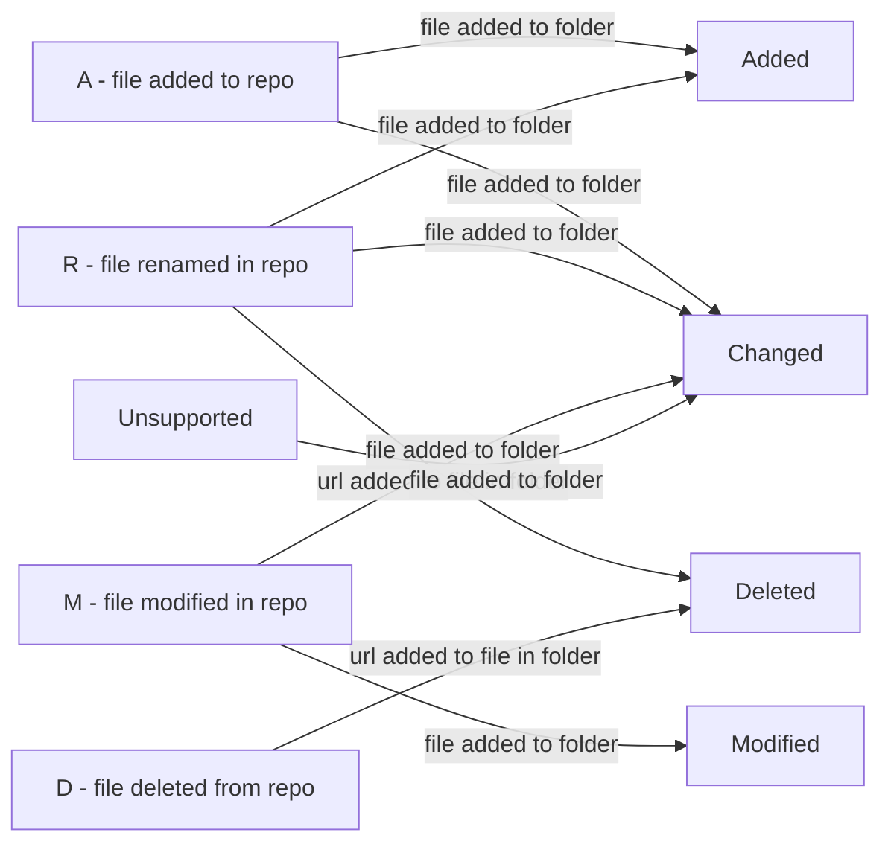

This extension includes the following tasks

* Git Copy Diff between 2 commits

## Git Copy Diff

Finds git-diff between two commits and copies files that have been added/modified/renamed/moved to a specified folder with extension \Changed. It also create one file in the folder \Deleted which files should be removed from reposity.
\Changed, \Deleted, \Modified and \Added folder will always be created even if nothing is stored in the folders


<!-- Markdown Grammar index https://github.com/github/linguist/blob/master/vendor/README.md -->
### Yaml example
```yaml
steps:
  - checkout: self
    persistCredentials: True

  - task: ATP.ATP-GitCopyDiff.GitCopyDiff.GitCopyDiff@6
    displayName: Git Copy Diff
    condition: and(succeeded(), ne(variables['${{parameters.deploy_reason}}'], 'Manual'))
    inputs:
      workingdir: '$(Build.SourcesDirectory)'
      destination: '$(Build.SourcesDirectory)'
      gittag: '${{parameters.LatestFeed}}'
      testIfTagFound: false
      branchAsRoot: 'origin/main'
      nameOfFileDeletedList: '${{parameters.fileName}}'
      textBeforeFile: ''
      textAfterFile: ''
```
## New features
New field "testIfTagFound", if true it will test if tag is found, if not it will fail.

How to find old commit, used for git diff
- first find old commit using tag
- if not found, then find the outbranch commit from default branch
- if not found, then use branchAsRoot
- and finaly using the first commit created for this repo

## features
Now using -LiteralPath instead of -Path
New field that names the file, that contains all url's of files removed from the repository. New input fields that add text before and after the url of the deleted file from repository, before it adds it to the file.

| Text before url              | Url                            | Text after the url      |
|------------------------------|--------------------------------|-------------------------|
| "Remove-Item -LiteralPath '" | /GIT/Subfolder/DeletedFile.ps1 | "' -ErrorAction Ignore" |

The result will be listed in the file like this:
Remove-Item -LiteralPath '/GIT/Subfolder/DeletedFile.ps1' -ErrorAction Ignoree


## features
Added new folders "Added" and "Modified".
Files that have been added or modified will copied to changed as usual, files than have been added will also be copied to the new folder "Added" and modified files will be copied to the new folder "Modified".

## Features
The diff is found between the two commits "Current commit" and "Tag".
"Current commit" use commit-id and if not set, HEAD will be used.
GitTag can be tag for given commit or can be hashid. If commit is not found, use branchAsRoot if value is insert, if not the first commit will be used.
You can specify which files to copy by change type.
Folder Changed and Deleted will be created even if there are no items to be found.
Flatten directory structure (all files to same directory).

### Prerequisites
* Repository must be Git.
* Always added git-repo to the pipeline (build or release)
* Allow scripts to access Oauth must be **Enabled**  
 Select this check box in classic build pipelines if you want to enable your script to use the build pipeline OAuth token. This check box is located under the "additional settings" section after selecting the agent job in the pipeline
 In yaml - add a checkout section with persistCredentials set to true.

## Credits

<div>Icons made by <a  href="http://www.flaticon.com/authors/madebyoliver"  title="Madebyoliver">Madebyoliver</a> from <a  href="http://www.flaticon.com"  title="Flaticon">www.flaticon.com</a> is licensed by <a  href="http://creativecommons.org/licenses/by/3.0/"  title="Creative Commons BY 3.0"  target="_blank">CC 3.0 BY</a></div>